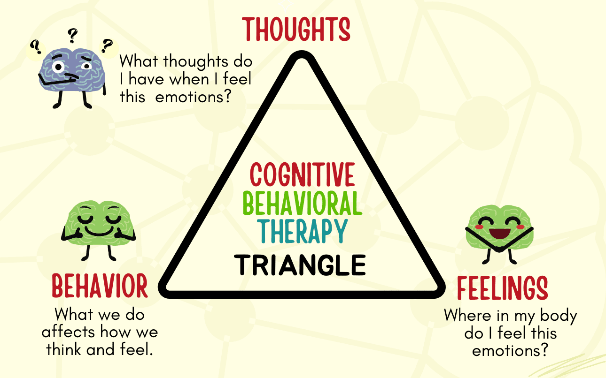
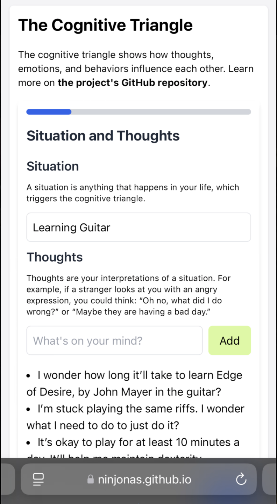
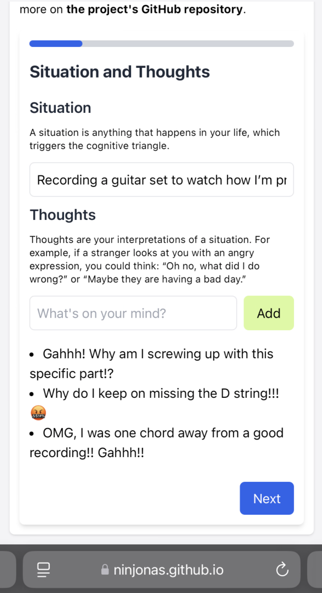
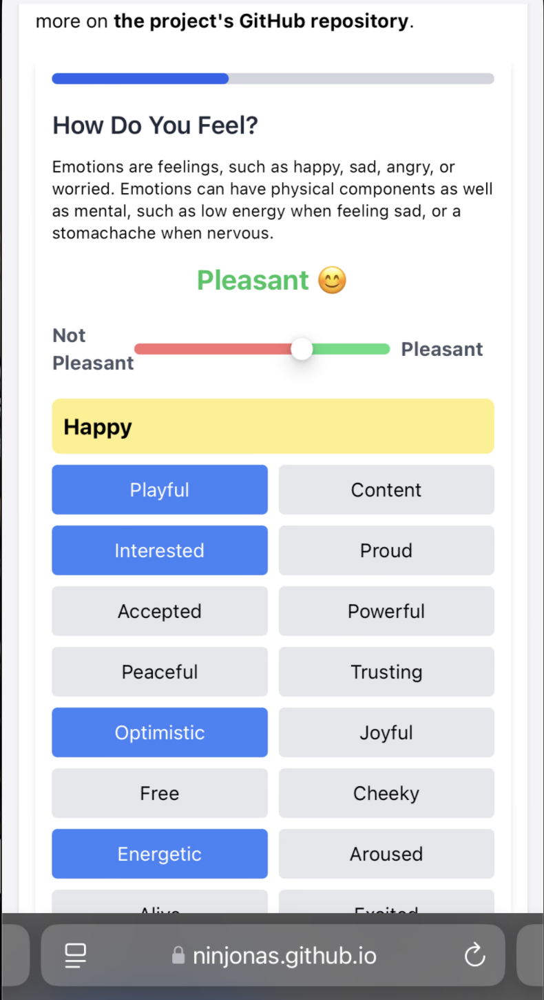
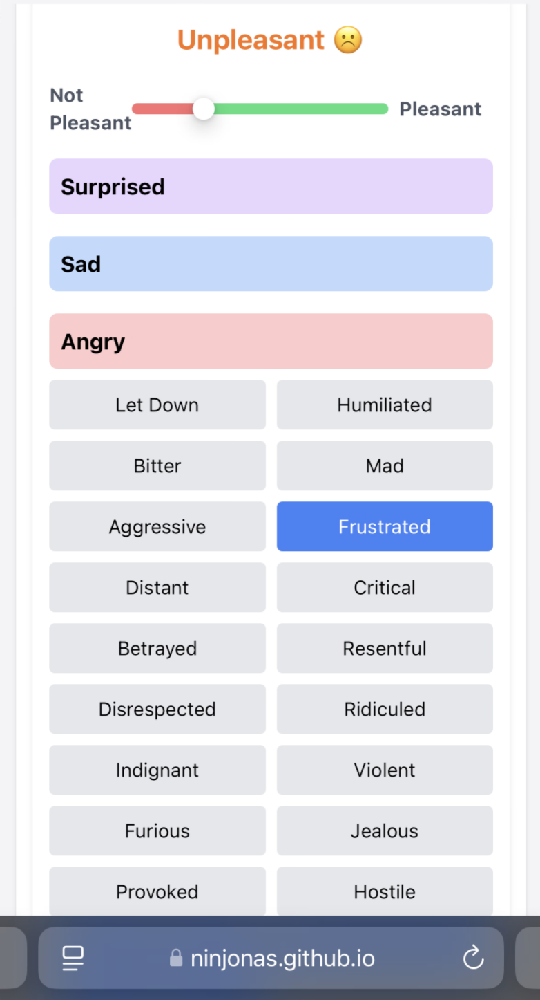
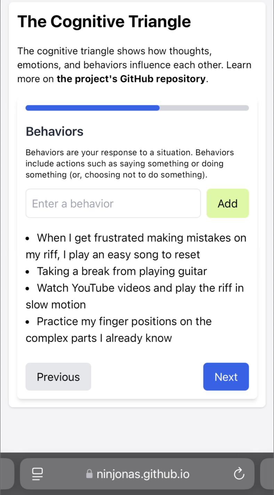
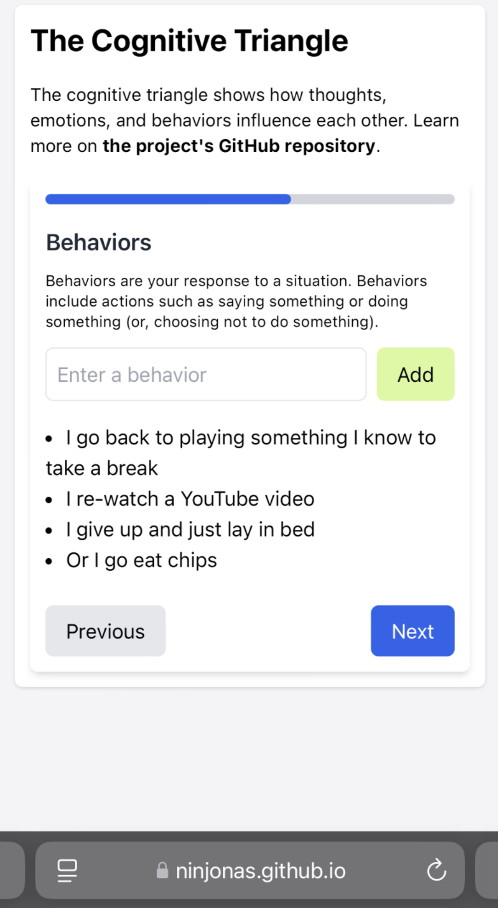
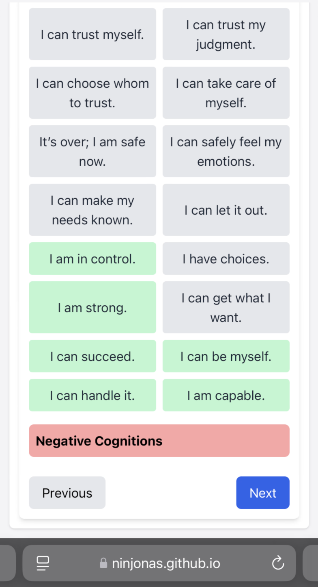
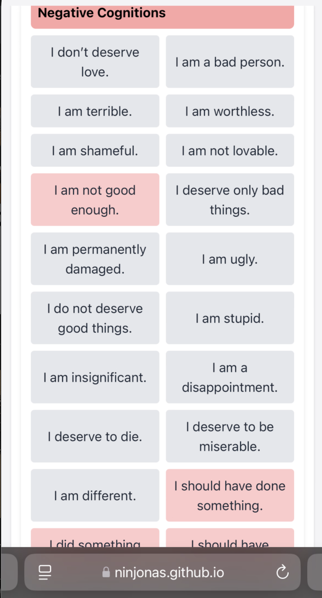
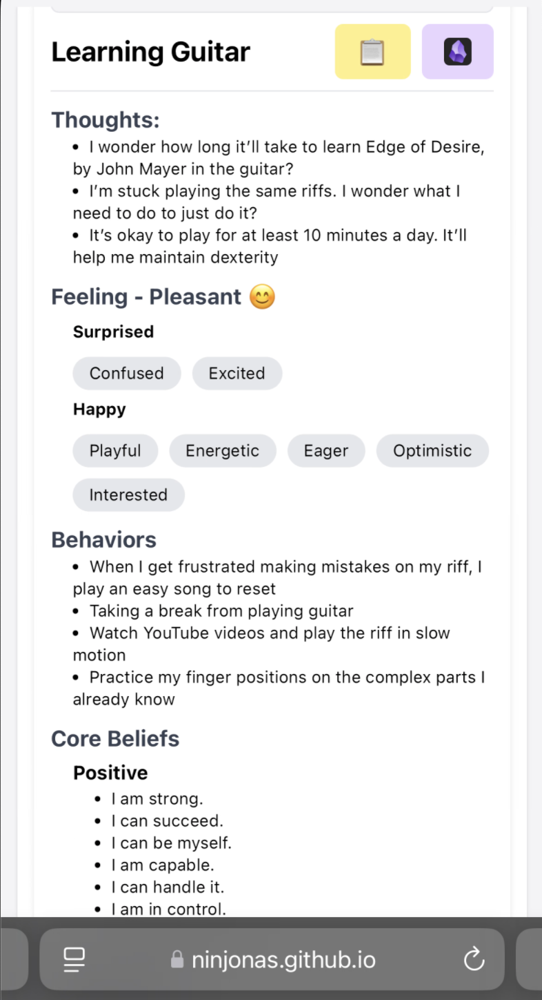

# The Cognitive Triangle

## What is the Cognitive Triangle?

The cognitive triangle is a simple [CBT](https://aanmc.org/naturopathic-medicine/cognitive-triangle-cbt/) tool you can use to help break negative thought patterns. It is
similar to keeping a thought record, but has more structure and requires you to positively reappraise your thoughts, feelings, and behaviors as opposed to just your
thoughts. 7

The cognitive triangle is a graph depicting thoughts, feelings, and behaviors all leading to one another, as shown below:



Image Source: [Mental Health Center Kids](https://mentalhealthcenterkids.com/blogs/articles/cbt-triangle/)

## What is this Project?

I've dealt with some life changing experiences in the past few years that have given me severe anxiety. After working with my therapist for over a year, they have showed
me techniques to help me rationalize my thoughts. The Cognitive Triangle helped me.

During my low points, I have used this method religiously. Over time, I'm able to now be aware of my feelings and have become calmer. I still have feelings of
insecureties one in a while and I've been forgetting to log my cognitions.

I'm hoping this project will help me easily log my cognitions and hopefully start tracking trends what cognitions I should work on

## Functionality

This application allows users to:

- Record and manage entries of their thoughts, feelings, and behaviors.
- View and edit existing entries.
- Delete entries.
- Review entries in a structured format.
- Use the cognitive triangle to positively reappraise their thoughts, feelings, and behaviors.

### Demo

You can see a live demo of the application in action at the following link: [CBT Triangle Demo](https://ninjonas.github.io/cbt-triangle/). This demo showcases the core
feature of the application, recording entries and using the cognitive triangle to positively reappraise thoughts, feelings, and behaviors. Explore the demo to understand
how this tool can help you track and manage your cognitive patterns effectively.

### Screenshots

| Step                  | Positive                                   | Negative                                   |
| --------------------- | ------------------------------------------ | ------------------------------------------ |
| Situations & Thoughts |  |  |
| Feelings              |  |  |
| Behaviors             |  |  |
| Core Beliefs          |  |  |
| Summary               |  |  |

## Technical Setup

### Prerequisites

- Node.js (version 14.x or later)
- npm (version 6.x or later)

### Installation

1. Install the dependencies

```sh
npm install
```

### Development

1. Start the development server

```sh
npm run dev
```

### Build Commands

1. Build the web application

```sh
npm run build
```

## License

This project is licensed under the MIT License.
