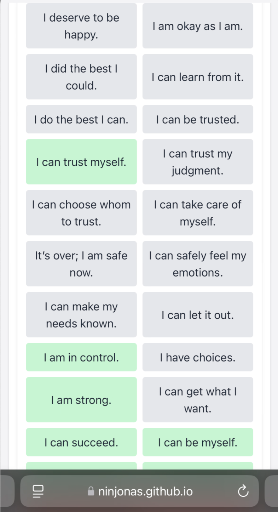
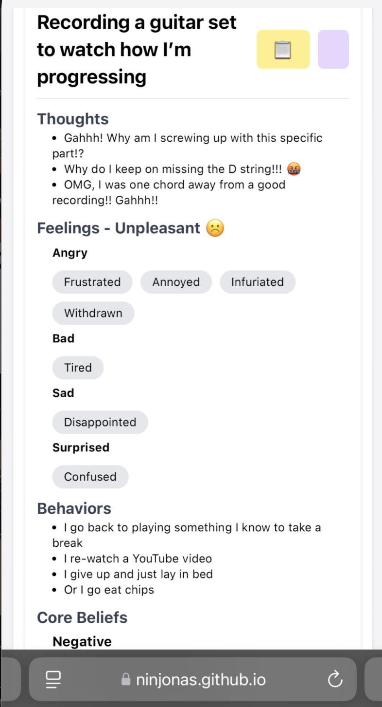

# The Cognitive Triangle

## What is the Cognitive Triangle?

The cognitive triangle is a simple [CBT](https://aanmc.org/naturopathic-medicine/cognitive-triangle-cbt/) tool you can use to help break negative thought patterns. It is
similar to keeping a thought record, but has more structure and requires you to positively reappraise your thoughts, feelings, and behaviors as opposed to just your
thoughts. 7

The cognitive triangle is a graph depicting thoughts, feelings, and behaviors all leading to one another, as shown below:


Image Source: [Mental Health Center Kids](https://mentalhealthcenterkids.com/blogs/articles/cbt-triangle/)

## What is this Project?

Over the past few years, I’ve experienced some life-changing events that have led to severe anxiety. After working with my therapist for over a year, I’ve learned
techniques to help me rationalize my thoughts. One of the most impactful tools has been the Cognitive Triangle.

During my lowest moments, I relied on this method consistently. Over time, it has helped me become more aware of my emotions and maintain a greater sense of calm. While I
still experience moments of insecurity, I’ve noticed that I’ve been forgetting to log my cognitions regularly.

With this project, I hope to make it easier to track and log my thoughts, and even identify patterns in the cognitions I need to work on. This method has been
transformative for me, and I’m excited to share it with anyone who finds their way to this repository.

## Functionality

This application allows users to:

- Record and manage entries of their thoughts, feelings, and behaviors.
- View and edit existing entries.
- Delete entries.
- Review entries in a structured format.
- Use the cognitive triangle to positively reappraise their thoughts, feelings, and behaviors.

### Demo

You can see a live demo of the application in action at the following link: [CBT Triangle Demo](https://ninjonas.github.io/cbt-triangle/). This demo showcases the core
feature of the application, recording entries and using the cognitive triangle to positively reappraise thoughts, feelings, and behaviors. Explore the demo to understand
how this tool can help you track and manage your cognitive patterns effectively.

### Screenshots

| Step                  | Positive                                   | Negative                                   |
| --------------------- | ------------------------------------------ | ------------------------------------------ |
| Situations & Thoughts |  |  |
| Feelings              |  |  |
| Behaviors             |  |  |
| Core Beliefs          |  |  |
| Summary               |  |  |

## Technical Setup

### Prerequisites

- Node.js (version 14.x or later)
- npm (version 6.x or later)

### Installation

1. Install the dependencies

```sh
npm install
```

### Development

1. Start the development server

```sh
npm run dev
```

### Build Commands

1. Build the web application

```sh
npm run build
```

## License

This project is licensed under the MIT License.
